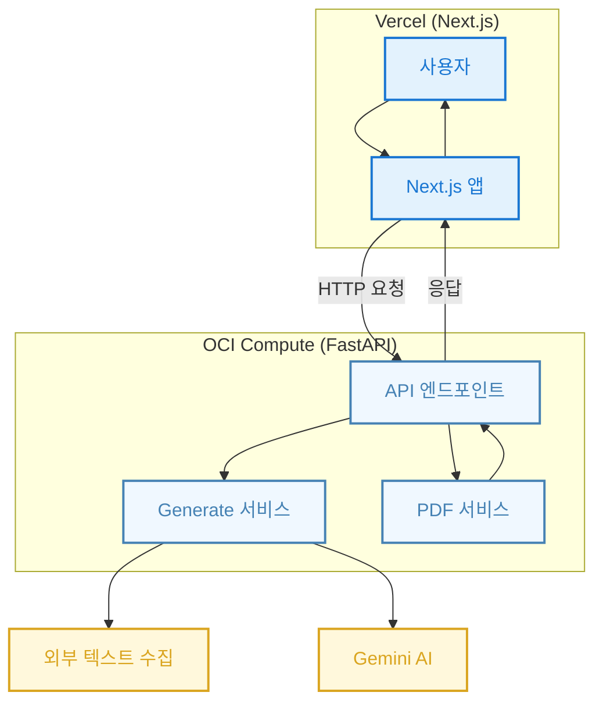

---

> ### 목차
> [1. 🚀 서비스 배포 링크](#-서비스-배포-링크) <br>
> [2. 💡 기획 배경](#-기획-배경) <br>
> [3. 📋 핵심 기능](#-핵심-기능) <br>
> [4. ⚙️ 서비스 아키텍처](#%EF%B8%8F-서비스-아키텍처) <br>
> [5. 💻 실행 방법](#-실행-방법) <br>
> [6. 📚 참고 링크](#-참고-링크) <br>
> [7. 👥 프로젝트 팀](#-프로젝트-팀) <br>
> [8. 📃 라이선스](#-라이선스) <br>

<br/>

# 🚀 서비스 배포 링크

>✨ DDALKKAK: https://ddalkkak.vercel.app/ <br/>
>📑 API Spec: https://ddalkkak.p-e.kr/docs

<br/>

# 💡 기획 배경

> <strong>'딸깍'</strong>은 이력서를 처음 작성하는 학생들이 겪는 어려움을 해결하고자 시작된 프로젝트입니다.<br/><br/>
사용자는 <strong>자신의 활동 링크(예: GitHub, Notion 등)</strong>만 입력하면,<br/>AI가 내용을 분석하여 구조화된 이력서 데이터를 생성하고,<br/>
깔끔한 템플릿으로 PDF까지 자동 생성해주는 서비스를 제공합니다.

<br/>

# 📋 핵심 기능

### 🔗 회원가입 없이 이력서 생성하기

> 번거로운 가입 과정 없이 빠르게 이력서 생성 시작이 가능합니다.

<table>
  <tr align="center">
    <td><strong>랜딩 페이지</strong></td>
  </tr>
  <tr align="center">
    <td>
      
    </td>
  </tr>
</table>

<br>

### 🔗 이력서 템플릿 선택하기

> 깔끔한 스타일의 디자인 템플릿이 5종 기본 제공됩니다.

<table>
  <tr align="center">
    <td><strong>진행할 이력서 템플릿 선택</strong></td>
  </tr>
  <tr align="center">
    <td>
      
    </td>
  </tr>
</table>

<br>


### 🔗 기본 정보 입력하기

> AI 이력서 생성을 위한 기본 정보를 입력합니다.<br/>
이름, 희망직무, 활동링크는 최소 1개 이상 입력이 필요합니다.<br/>
입력한 데이터에 따라 크롤링과 LLM 생성에 약 30초~3분 가량이 소요됩니다.


<table>
  <tr align="center">
    <td><strong>기본 정보 입력 폼</strong></td>
  </tr>
  <tr align="center">
    <td>
      
    </td>
  </tr>
</table>

<br>

### 🔗 이력서 수정하기

> 생성된 이력서를 기반으로 수정하며 더욱 완벽한 나만의 이력서를 완성합니다.<br/>
왼쪽에는 수정 폼, 오른쪽에는 선택한 템플릿이 적용된 프리뷰를 보여줍니다.<br/>
각 창의 사이즈를 조절할 수 있으며, 다른 템플릿을 적용해 볼 수 있습니다.

<table>
  <tr align="center">
    <td><strong>이력서 편집 화면</strong></td>
  </tr>
  <tr align="center">
    <td>
      
    </td>
  </tr>
</table>

<table>
  <tr align="center">
    <td><strong>템플릿 변경</strong></td>
  </tr>
  <tr align="center">
    <td>
      
    </td>
  </tr>
</table>

<br>

### 🔗 PDF & HTML 파일 다운로드

> 편집이 완료된 이력서를 버튼 클릭 한 번으로 빠르게 다운로드 받을 수 있습니다<br/>

<table>
  <tr align="center">
    <td><strong>파일 다운로드</strong></td>
  </tr>
  <tr align="center">
    <td>
      
    </td>
  </tr>
</table>


<br>

# ⚙️ 서비스 아키텍처



<br/>

# 💻 실행 방법


### 1️⃣ 사전 요구사항

1. **Python 3.8 이상 설치**
2. **가상환경 설정 권장**

    ```bash
    python -m venv .venv
    source .venv/bin/activate    # macOS/Linux
    .venv\\Scripts\\activate       # Windows
    
    ```


### 2️⃣ 설치 방법

1. GitHub 저장소를 클론

    ```bash
    git clone https://github.com/DDAL-KKAK-DOT/DDALKKAK.git
    ```

2. 가상환경 활성화 및 의존성 설치

    ```bash
    
    python -m venv .venv
    source .venv/bin/activate    # macOS/Linux
    .venv\Scripts\activate       # Windows
    
    pip install --upgrade pip
    pip install -r requirements.txt
    ```


### 3️⃣ 설정

1. **환경 변수 설정 (선택 사항)**
    - PDF 엔진 경로, 템플릿 디렉토리 경로 등을 `.env` 파일에 정의하세요.
    - 예시 (`.env`):

        ```
        GEMINI_API_KEY="YOUR_API_KEY"
        ```

### 4️⃣ 사용 방법

#### 서버 실행 방법 (FastAPI)

1. 서버 실행

    ```bash
    uvicorn backend.service:app --reload --host 0.0.0.0 --port 8000
    ```

2. 브라우저에서 접속

    ```bash
    http://localhost:8000/docs
    ```

   또는

    ```
    http://localhost:8000/redoc
    ```

### 5️⃣ 샘플 입력 및 출력

- **JSON 예시**

 ```json
{
  "profileInfo": {
    "name": "김오스스",
    "english_name": "OSS Kim",
    "educations": ["중앙대학교"],
    "desired_role": "백엔드 개발자",
    "contact": "OSS.kim@example.com",
    "activity_links": ["https://github.com/OSS"]
  },
  "shortIntro": "REST API에 익숙한 백엔드 개발자입니다.",
  "skills": [
    "Python (상) - 웹 서비스 개발 및 데이터 처리 경험 보유",
    "FastAPI (중) - 경량 API 서버 구현 경험 있음"
  ],
  "projects": [
    {
      "name": "Resume Generator",
      "period": "2024.03 - 2024.05",
      "role": "백엔드 개발",
      "description": "자동 이력서 생성기 개발",
      "honor": "반자동화로 작성 시간 70% 단축"
    }
  ],
  "career": [
    {
      "role": "인턴",
      "company": "ABC Tech",
      "period": "2024.07 - 2024.08",
      "description": "FastAPI 기반 서버 구축 경험"
    }
  ],
  "education": [
    {
      "name": "중앙대학교",
      "period": "2019.03 - 2023.02",
      "description": "소프트웨어학부 전공"
    }
  ],
  "clubs": [
    {
      "name": "알고리즘 학회",
      "period": "2020.03 - 2021.12",
      "description": "PS 스터디 운영"
    }
  ]
}
```

<br/>

# 📚 참고 링크

| 구분 | 설명 | 링크 |
|------|------|------|
| 📖 프로젝트 위키 | 서비스 소개, 컨벤션, 발표 자료, 기술 정리 등| [Ddalkkak Wiki 바로가기](https://github.com/DDAL-KKAK-DOT/DDALKKAK/wiki) |
| 🤝 Contributing Guide | PR 규칙, 커밋 컨벤션, 브랜치 전략 등 협업 가이드 | [CONTRIBUTING.md](https://github.com/DDAL-KKAK-DOT/DDALKKAK/blob/main/CONTRIBUTING.md) |


<br/>

# 👥 프로젝트 팀

| 고민지 | 나상현 | 김예찬 | 조하은 |
|:------:|:------:|:------:|:------:|
|  |  |  |  |
| **FE** | **BE** | **BE** | **BE** |
| [@gominzip](https://github.com/gominzip) | [@sanghyunna](https://github.com/sanghyunna) | [@ii2001](https://github.com/ii2001) | [@haeun030](https://github.com/haeun030) |

<br/>

# 📃 라이선스

이 프로젝트는 [MIT 라이선스](https://github.com/DDAL-KKAK-DOT/DDALKKAK?tab=MIT-1-ov-file)를 따릅니다. 자유롭게 사용, 수정, 배포가 가능합니다.

<br/>
